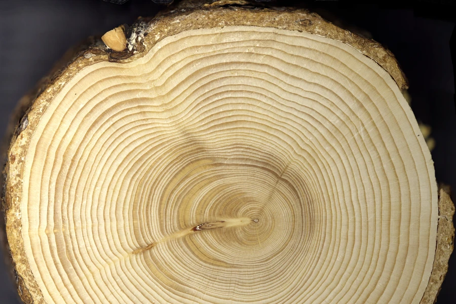
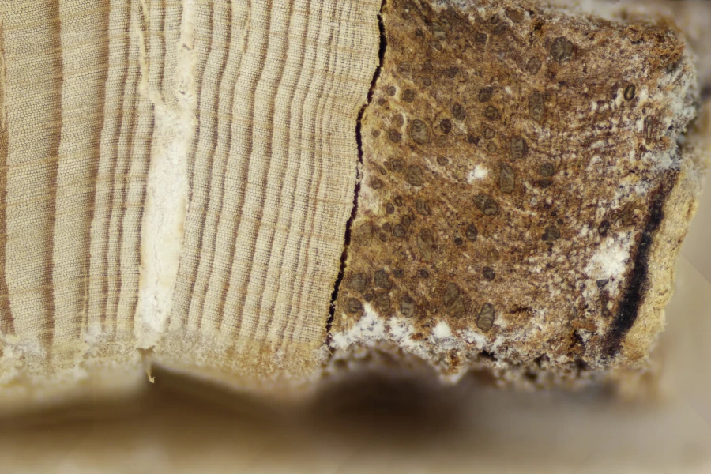
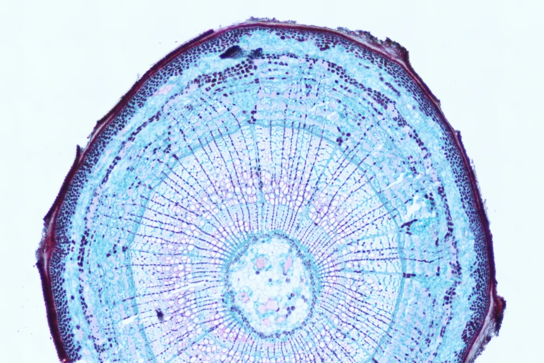
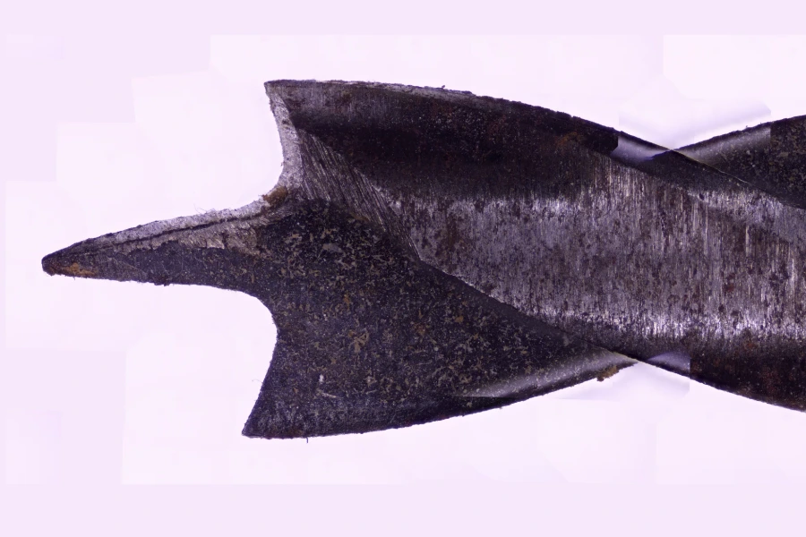
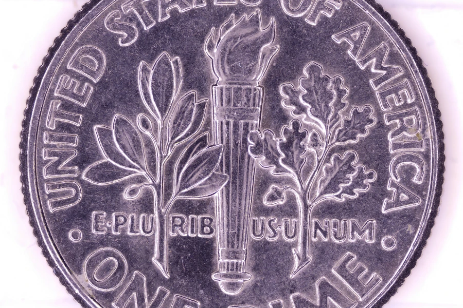
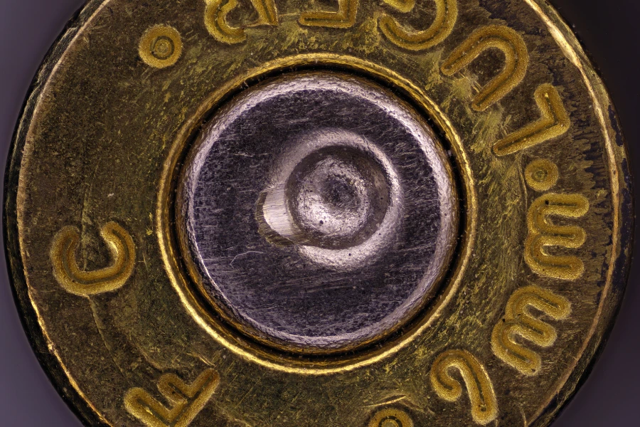

# FieldWeave - Low Cost Gigapixel Imaging Machine

[](#)
[](#)

[](https://github.com/sponsors/AnthonyvW)
[](https://ko-fi.com/procerand)
[](https://discord.gg/nZh4uWUV4b)

FieldWeave is an open-source, gigapixel imaging system built on a modified off-the-shelf 3D printer. It automates sample capture, focus stacking, and DPI calibration, producing high resolution images across a wide range of fields. See it in action on the [FieldWeave website](https://www.fieldweave.com), which includes an interactive gallery for browsing full-resolution scans.

**If FieldWeave is useful to you, please consider supporting its development. See [Support FieldWeave](#support-fieldweave) below.**

## Features

* **Automated Scanning**: Utilizes 3D printer mechanics for precise, repeatable sample movement.
* **High-Resolution Imaging**: Captures gigapixel images across dendrochronology, geology, life sciences, museum, manufacturing, and forensic use cases.
* **Focus Stacking**: Built-in stacking via FocusWeave.
* **Automated DPI Calibration**: Calibrates scan resolution automatically against a compatible micrometer slide.
* **Modular Design**: Easily adaptable to different sample types, lenses, and imaging requirements.


## Examples

### [Browse the full gallery at fieldweave.com/gallery](https://www.fieldweave.com/gallery)


<table>
  <tr>
    <td width="33%">
      <a href="https://www.fieldweave.com/gallery/image/cross-section-1">
        
      </a>
    </td>
    <td width="33%">
      <a href="https://www.fieldweave.com/gallery/image/western-hemlock-core">
        
      </a>
    </td>
    <td width="33%">
      <a href="https://www.fieldweave.com/gallery/image/basswood-stem-cs">
        
      </a>
    </td>
  </tr>
	<tr>
    <th>Black spruce tree core cross section</th>
    <th>Western hemlock tree core</th>
    <th>Basswood stem cross section</th>
	</tr>
  <tr>
    <td width="33%">
      <a href="https://www.fieldweave.com/gallery/image/rusty-7-16-drill-bit">
        
      </a>
    </td>
    <td width="33%">
      <a href="https://www.fieldweave.com/gallery/image/us-dime-back">
        
      </a>
    </td>
    <td width="33%">
      <a href="https://www.fieldweave.com/gallery/image/9mm-1">
        
      </a>
    </td>
  </tr>
	<tr>
    <th>A rusty 7/16 drill bit</th>
    <th>Back of a US dime</th>
    <th>Spent 9mm bullet casing</th>
	</tr>
</table>

## Support FieldWeave

FieldWeave is free and GPL-licensed, and stays that way through community support. If it's useful to your lab, workflow, or project, consider chipping in. Funding goes directly toward hardware, testing, and development time.

* **GitHub Sponsors**: [github.com/sponsors/AnthonyvW](https://github.com/sponsors/AnthonyvW)
* **Ko-fi**: [ko-fi.com/procerand](https://ko-fi.com/procerand)

Have a specific feature your lab needs? [Commission a feature](https://www.fieldweave.com/contact) it gets built for you and becomes available to everyone.

## Getting Started

### Prerequisites

* **Hardware**: A [compatible 3D printer](#3d-printer-compatibility) modified for imaging purposes, a light, and a [compatible camera](#confirmed-compatible-cameras). The 3D printer may also require an additional cable to connect your PC to the printer. Note that this modification will likely void the warranty if you disconnect any cables, so test the 3D printer to ensure the motion system works before doing this.
  * For the light I recommend using the [Amscope 144 led ring light](https://www.amazon.com/dp/B00JZJO7YC). If you use this, make sure to 3D print the light pads to prevent scratching the lens.
  * If using an Amscope camera, I highly recommend using this ([100x Microscope Lens for Raspberry Pi](https://www.amazon.com/100X-Microscope-Lens-Magnification-Compatible/dp/B0C1CC79TX)) industrial lens as it provides minimal distortion around the edges.
  * Not required, but is recommended is a thumbscrew for holding the camera in place. I use thumbscrews from [this 16 piece set](https://www.amazon.com/dp/B0DQPM68KJ) from Amazon.
  * For the automated DPI calibration to work, a compatible micrometer calibration slide is required. It is confirmed to work with the [Amscope MR400 Stage Micrometer Calibration Slide with 4-Scales](https://amscope.com/products/mr400). I am interested in adding support for additional scales.
  * If you do not have access to a 3D printer capable of printing in at least 2 colors and wish to image tree core samples, then a roll of red electrical tape to denote the center of slots.
* **High Magnification Imaging Hardware**
  * Note: This is a more expensive version that achieves far greater magnification than most other setups, however it requires additional modifications. Instead of using the 100x lens listed above, use the following parts instead for the optics.
  * To successfully do this version with 10x objective it will require upgrading the leadscrews to [350mm Tr8X2 2mm lead](https://www.amazon.com/dp/B095M8SQQV?th=1) with the appropriate [anti backlash nuts](https://www.amazon.com/dp/B085GGMCVG?th=1)
  * For the tube lense I recommend using the [Raynox DCR 250 Lens](https://www.amazon.com/Raynox-DCR-250-Super-Macro-Snap/dp/B000A1SZ2Y/) as there are 3D models present that use that.
  * [M49 to RMS Adapter](https://www.amazon.com/dp/B0FHN8FQ7T) for connecting the microscope objective to the tube lens
  * [C Mount to M42 Adapter](https://www.amazon.com/dp/B0812QPHWN) for connecting the camera to the high magnification setup.
  * For the high magnification setup, 1/4" thumbscrews are required to hold the camera in place. I use thumbscrews from [this 16 piece set](https://www.amazon.com/dp/B0DQPM68KJ) from Amazon.
  * For the microscope objective I recommend either the [Amscope 4x Metallurgic objective](https://amscope.com/products/pl4x-inf-v300) or the [Amscope 10x metallurgic objective](https://amscope.com/products/pl10x-inf-v300) both objectives are infinity plan achromatic objectives. Using anything above 10x is not recommended due to the depth of field becoming shallower than what the machine is capable of moving.
  * Due to the depth of the holes on the 3D printed parts I recommend getting a set of longer than usual metric hex keys so you can screw everything in properly. I use [this set.](https://www.amazon.com/dp/B0000CBJDV) 
* **Software**: Python 3.x and Git
* **Operating System**: Linux, Windows 10, or Windows 11

## Printer Modification

Before using FieldWeave, your 3D printer must be modified to mount the camera system in place of the print head.

### Required Printed Parts

Before modifying your printer, you must 3D print the following components:

- **Camera Mount** - Ender 3 Camera Mount.3mf – Attaches to the existing print head carriage  
- **High Resolution Camera Mount Files** - high_magnification folder
  * These are only for if you are going with the high magnification version of FieldWeave.
  * MicroscopeObjectiveMount.3mf - Attaches to print head carriage
  * Light Baffles.3mf - Insert to objective mount after screwing the mount in.
  * Amscope Mount.3mf - Attaches to the print head carriage to hold camera in place
  * RaynoxRingLightBuffer.3mf - Use if using the amscope ring light with it. You will need 3 of these. These help hold the ring light still.
- **Z-Axis Spacer** - ZAxisSpacer.3mf – Raises the Z-axis endstop to accommodate the new camera height  
    - If you are proficient with working with electronics, I suggest replacing the Z axis end stop wires with longer ones instead and mounting the Z axis limit switch higher.

> files for these parts will be provided in the `hardware/` folder of this repository.

### Optional Printed Parts
- **Calibration Slide Tray** - If using a micrometer calibration slide, this tray holds it stationary on the bed of the machine while providing a solid colored background.
- **Sample Clips** – Secure tree core samples to the print bed without manual alignment
    - SampleHolderEnd.3mf
    - SampleHolderFooter.3mf - If printing the multicolor version ensure that all the tick marks are printed in a red filament.
    - SampleHolderMiddle.3mf - You will need 3 of these. I suggest printing one of these off and ensuring that it properly fits before printing off the rest of the parts.
---

### Modification Instructions

> ! IMPORTANT ! Ensure that you have all 3D printed parts before modifying your 3D printer.

1. **Unplug 3D Printer**  
   Ensure the 3D printer is disconnected from power before working on it.

2. **Remove the Print Head**  
   Unscrew and detach the printer's hotend from the X-axis print carriage.

3. **Disconnect Wiring**  
   Carefully disconnect the hotend and heatbed wiring from the printer's control board. This prevents accidental heating or movement of the removed components.

4. **Install Camera Mount**  
   Use the print head screws to attach the printed camera mount to the same location on the print carriage where the print head was originally mounted.

5. **Insert Z-Axis Spacer**  
   Add the printed Z-axis spacer on the Z endstop, so the camera does not crash while homing.

6. **Insert sample clips**
   If you choose to use sample clips then this is the stage where you would want to slide them onto the print bed. If you printed the footer in single color you will also want to mark the center of the slots (above the slot not in the slot) with a red mark. I recommend using red electrical tape as it doesn't fade.

7. **Install Camera and Lens**  
   - Insert your digital microscope or Amscope camera into the printed mount.  
   - Screw on the imaging lens securely.  
   
8. **Install Light**  
   Install the light you will be using with FieldWeave. 
   > If using the Amscope ring light, place the light pads onto the metal tips of the screws that hold the light in place before putting the light on the lens.

9. **Plug Everything in**  
   - Plug the 3D printer back into the wall
   - Plug the 3D printer into your computer via USB for motion control.  
   - Plug in the camera using its USB interface for image capture.
   - Plug in the Light

10. **Done**

### Installation

Prerequisites\. Ensure you have the latest version of python installed, and you have git installed.

> Python : https://www.python.org/downloads/  
> Git : https://git-scm.com/downloads

1\. Clone the repository:

   ```bash
   git clone https://github.com/AnthonyvW/FieldWeave.git
   cd FieldWeave
   ```


2\. Install the required Python packages:

  ```bash
  pip install -r requirements.txt
  ```

3\.1\. Download the Amscope SDK for your camera at https://amscope.com/pages/software-downloads if you are on mac or linux, download the windows version as it includes the files for those operating systems there.

3\.2\. Move the downloaded zipped folder into 3rd_party_imports

4\. Run the install scripts:

  Windows
  ```bash
  windows_install.bat
  ```
  Linux
  ```bash
  ./ubuntu_install.sh
  ```
5\. Start FieldWeave

  Windows
  ```bash
  windows_start.bat
  ```
  Linux
  ```bash
  ./ubuntu_start.sh
  ```

---
## Confirmed Compatible Cameras
FieldWeave supports USB cameras through a modular driver architecture.

| Camera Model            | Notes                       |
|-------------------------|-----------------------------|
| Amscope MU500           | Fully tested and supported  |
| Amscope MU1000          | Fully tested, the automatic DPI calibration might not work due to it being tested at a lower resolution than this camera's max resolution |
| Amscope MU1000 HS       | Fully tested, the automatic DPI calibration might not work due to it being tested at a lower resolution than this camera's max resolution |
| Generic USB Camera      | This was tested with 2 different USB cameras and is supported  |
| Other Amscope Cameras   | They should work, but are not tested. Camera mount might need to be modfied for them to fit. |

⚠️ Amscope's SDK on their website is currently out of date as of 8/15/2026. If you contact Amscope support an up to date version can be provided. The SDK version I use is Version: 59.30149.20251130

### Adding Support for New Cameras

Users are encouraged to contribute new camera interfaces by implementing the FieldWeave camera interface and submitting them as pull requests.

If your camera is not currently supported or you would like to contribute an interfaces, please open an issue or submit a pull request.

Due to the complexity of hardware integration, especially with cameras requiring proprietary APIs or SDKs full support often requires physical access to the device for development and testing. If you would like me to implement support for your camera, please be prepared to ship the device or provide access to equivalent hardware.

Alternatively, contributions of driver implementations with thorough documentation and test instructions are highly appreciated.


## 3D Printer Compatibility

FieldWeave is designed to run on 3D printers using **Marlin firmware**, which supports standard G-code over USB serial. Compatibility with other firmware types varies and may require additional configuration or is not currently supported.

> Not sure if your 3D printer will work? Plug your printer into your computer via USB, and then start FieldWeave. If the printer homes then it is compatible with FieldWeave.

## Confirmed Compatible Printers

| Printer Model           | Firmware | Build Volume (mm) | Notes                                                  |
|-------------------------|----------|-------------------|--------------------------------------------------------|
| Ender 3 v1              | Marlin   | 220 × 220 × 250   | Fully tested and supported. It is highly recommended that you use the official linear rail upgrade kit provided by Creality for the increased camera stability.                             |
| Creality CR-10S Pro v2  | Marlin   | 300 × 300 × 400   | Fully tested; camera mount file not available.         |
| Anycubic Kobra Max v1   | Marlin   | 400 × 400 × 450   | Fully tested; camera mount file not available.         |
---

> Want to help verify compatibility with other printers, firmware, or cameras?  
> [Open an issue](https://github.com/AnthonyvW/FieldWeave/issues) with your setup details and test results!

## Confirmed Incompatible Printers

| Printer Model           | Build Volume (mm) | Notes                                                    |
|-------------------------|-------------------|----------------------------------------------------------|
| Bambulab A1             | 220 × 220 × 250   | Properietary Firmware, cannot send gcode directly to it  |

---

## Contributing

Contributions are welcome! Please fork the repository and submit a pull request with your enhancements. For major changes, open an issue first to discuss your proposed modifications.

Not able to contribute code? Financial support is just as valuable; see [Support FieldWeave](#support-fieldweave) above ([GitHub Sponsors](https://github.com/sponsors/AnthonyvW) / [Ko-fi](https://ko-fi.com/procerand)).

## Troubleshooting

**Camera freezes when taking pictures**
- Sometimes the serial drivers conflict with the camera drivers, to fix this, plug in the camera and the 3D printer into two different sides of the computer. This forces them to be on different usb controllers which fixes any conflicts they might have.

**My Camera isn't found**
- Make sure that you have the camera drivers installed. If your camera was previously found, but is no longer found, try unplugging it and plugging it back in and ensuring the OS detects that it is plugged in as it might be a bad cable.